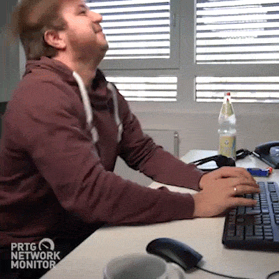

author: JJ & KK & NB
summary: Frontend onboarding
id: index
tags: Frontend, Vue
categories:
environments: Vue
status: Draft
feedback link: https://github.com/SolaceDev/solace-dev-codelabs/blob/master/markdown/android-test

# Wiselab Onboarding Frontend

## Overview

#### First of all, welcome to **Wisemen!** We are happy to have you here and we hope you will have a great time working with us.


In this onboarding you will learn how frontend development happens at Wisemen.
You will learn how we use Vue, Vite, Tailwind, Figma, Github, Linear and more to our advantage.

For all our new projects we use a self-made template together with our vue-core library.
This template consists of all the things we need to get started quickly and don't have to reinvent the wheel every time we start a new project.
The vue-core library is a component library that contain the most common components and composables that we use in our projects. 
We are continuously improving our template and vue-core, if there is a bug or something is missing, 
let us know so that we can fix it or discuss the issue and find a solution.

This onboarding is designed to be completed in 2-3 days. 
People with more experience will be able to complete it faster, so don't worry if you need some more time.

In this codelab we are going to create a simple to-do app.
This app will be used as an example to teach you how we structure our projects, write our code and learn the tools and libraries we use.

> aside positive
> The template will do a lot of work for you.
> We definitely recommend that you try and understand what each of the existing components are used for and how they work.
> No, you don't need to know everything, but it will help you solve issues faster.

We expect you to make pull requests of your work so that your buddy can review your code and keep track of your progress.
The way we do this will be explained in the next steps.

Good luck on becoming the front-end developer you are meant to be!
And remember, asking questions is always a good thing!



## Prerequisites

### IDE

There are 2 different IDE's you can use to work with Vue. You can use either **Visual Studio Code** or **WebStorm**. The Choice is yours, so choose wisely.

#### WebStorm

WebStorm is a JavaScript IDE with complete set of tools for client-side and server-side development and testing.
It provides code completion, on-the-fly error detection, powerful navigation and refactoring for JavaScript, TypeScript,
CSS, HTML and more.

Webstorm is a paid IDE. You can get a free license as a Student by using your school email.

[Download WebStorm](https://www.jetbrains.com/webstorm/download)

Handy Plugins:
- **GitHub CoPilot** (AI pair programmer)
- **Easy i18n** (i18n support in WebStorm)
- **Vue** (Vue.js support for WebStorm)
- **Material UI** (Fancy themes)

#### Visual Studio Code

Visual Studio Code is a source-code editor developed by Microsoft for Windows, Linux and macOS.
It includes support for debugging, syntax highlighting, intelligent code completion, snippets, and code refactoring.

Visual Studio Code is a free IDE. You can download it from the website.

[Download vscode](https://code.visualstudio.com/download)

Handy Plugins:
- **Volar** (processing vue files)
- **ESLint** (code formatting)
- **Error lens** (showing errors in the code)
- **Guthub Copilot** (AI pair programmer)
- **I18n ally** (i18n support in vscode, managing translations)
- **Pretty Typescript Errors** (formatting ts errors so they are more readable)
- **Tailwind CSS intellisense** (tailwind css support)
- **VSCode-icons** (cool file and folder icons)
- **TODO tree** (showing all the TODO's in the project)
- **Vitest** (running tests)
- **GitLens** (git support)

Choose the IDE you want to work with and download it.

### Node.js

Node.js is an open-source, cross-platform, back-end JavaScript runtime environment
that runs on the V8 engine and executes JavaScript code outside a web browser.

Node.js is necessary to run the Vue project. You can download it from the website.

[Download Node.js](https://nodejs.org/en/download/)

### NPM vs PNPM

* [NPM](https://www.npmjs.com/get-npm)
  NPM is the default package manager for the JavaScript runtime environment Node.js. The NPM program is installed on
  Node.js when you install it from its website.

* [PNPM](https://pnpm.io/installation)
  PNPM is a fast, disk space efficient package manager. 
* It is designed to be installed globally, and it installs all the packages that you need in your project in a single place, using symlinks.

The difference between NPM and PNPM is that PNPM uses symlinks to link packages to your project. 
This means that if you have multiple projects that use the same package, it will only be installed once on your computer. 
This saves a lot of disk space. PNPM is also faster than NPM because it uses symlinks.

> aside positive
> We use PNPM in our projects.

### Our template

This is a good time to take a quick look at our template. You can find it here: [vue template](https://github.com/wisemen-digital/vue-project-template).
Take a quick look around to get familiar with the structure of the project. Ask your buddy if you have any questions. 
But don't worry, we will go through it in this onboarding.

### Vue-core component library

Our template uses the **vue-core** component library, which contains the most common components that we use across our projects. You'll be using these components throughout this onboarding when building the todo app.

Take some time to explore the vue-core documentation to familiarize yourself with the available components:

[Vue-core Documentation](https://wisemen-digital.github.io/vue-core/packages/components-next/getting-started/installation.html)

> aside positive
> Understanding the vue-core components before you start implementation will help you work more efficiently. Don't worry about memorizing everything - you can always reference the documentation as you build.

### Figma

Our designers work with **Figma**.
Figma is a vector graphics editor and prototyping tool which is browser-based or can be installed on macOS or Windows.
We recommend you to install the desktop app.

[Download Figma](https://www.figma.com/downloads/)

Take a look around in Figma and try to get familiar with the tool. You will be using it a lot in the future.
You can view all of our designs here:

[Wisemen Figma](https://www.figma.com/files/team/1070403287155222588/Wisemen?fuid=1070747045190465434)

To access the designs you need to log in with your Wisemen account: 
[wireframes](https://www.figma.com/file/hebgv4Qx8VanMAQkO1NFpa/Onboarding-to-do?node-id=407-4095&t=2qdyy89lKwN7dFw3-0)

### Source control

#### GitHub

GitHub is a web-based version control repository hosting service owned by Microsoft, for source code and development
projects that use the Git revision control system.

Our projects will be hosted on GitHub.

If you are not yet familiar with GitHub, Here is great article to get you started:
[GitHub Git tutorial](https://docs.github.com/en/get-started/start-your-journey/hello-world)

We expect you to make pull request of your work so your buddy can review your code and keep
track of your progress.

> aside positive
> You can find our GitHub organization here: [Wisemen GitHub](https://github.com/wisemen-digital)

## Project explanation

You will be creating a simple to-do app. The app can be used to create, edit and delete to-do's.
The backend is already created, and you can find the documentation here:

[Backend documentation](https://onboarding-todo-api.development.appwi.se/api/v1/docs/)

Username: `appwise`  
Password: `password`

### Requirements

- Login page with email and password
- View your to-do's in a list
- Create a new to-do
- Edit a to-do
- Delete a to-do
- Mark a to-do as done

### Designs

The designs for the to-do app can be found in Figma. Login with your Wisemen google account to view the designs.
You can find the designs here:


[Figma designs](https://www.figma.com/file/hebgv4Qx8VanMAQkO1NFpa/Onboarding-to-do?type=design&node-id=467-4945&mode=design&t=c2mb4igTcdZQaH6X-4)

> aside positive
> Make sure that you use the "Web" designs for this onboarding.

## Project Template

Before you start with the project, you need to understand what the project template contains and how it is structured.

Our [frontend bible](https://wisemen-digital.github.io/frontend-bible/project-template) 
explains everything you need to know about the project template.

### Clone the template

Go to the [project template](https://github.com/wisemen-digital/vue-project-template) and click on the `Use this template` button to create a new repository.

Use your private GitHub account to create the repository and give it the name `onboarding-todo`

## PROJECT: Battle plan 

Now that we have a basic understanding of the project template
and all the different elements that a frontend contains,
let's get started with building the actual application.

1. Before we can create, update and delete todo's, we need to be able to login to the application.
Luckily for us, the template already contains a fully functional login page. 
2. Once the user is logged in, we will need to create a view that contains a list of todo's. 
3. This list will be fetched from the backend using queries and displayed in a list view. 
4. Once we can display the todos, we will need to create a dialog that contains a form that can be used to create a new todo. 
5. Here you will learn about mutations and how to use them to update data in the backend and invalidate your queries.
6. After completing our create form, we will need to update it so that we can edit them.
7. Once we can create and edit them, we will need to add a button to delete them.
8. After we have completed these tasks, we will need to add a button to the list view that can be used to mark a todo as done.
9. If you have time left, you can add some extra features to the application. For example, you can add a search bar to search for todos, or add a filter to filter the todos by status.

> aside negative
> This following steps are a guide to push you in the right direction. 
> The project template contains enough examples to help you create the application.   

## PROJECT: Http layer & API client

The most important aspect of programming is **separation of concerns.** and **DRY** (Don't Repeat Yourself).
This means that you should separate your code into different layers and files.
This will make your code more readable, reusable and easier to maintain.

The fastest way would be to do your http calls directly in your component, but this will make your component less reusable and harder to
maintain in the future.

That's why we use services to make our backend calls. This way we can let the service be responsible for fetching and transforming data and make our code more
readable and maintainable.

### Authentication
The template handles authentication for you. You only need to change the environment variables to match the backend.

### Environment variables
To make sure that we don't hardcode the base url of the backend in our service, we will use environment variables.

- Create a new file called `.env` in the root of your project.
- Add a new variable called `API_BASE_URL` and set it to the base url of the backend.
- Do the same for the `AUTH_BASE_URL`, `AUTH_CLIENT_ID` and `AUTH_ORGANIZATION_ID` variables. 
- These will be used with Zitadel to authenticate the user.

```env
API_BASE_URL=https://onboarding-todo.internal.appwi.se

AUTH_BASE_URL=https://zitadel.internal.appwi.se
AUTH_CLIENT_ID=305078631263175721
AUTH_ORGANIZATION_ID=284257737964064935

ENVIRONMENT=development
```

### Hey-api

If you go to the `http.lib.ts` file in the `libs` folder, you will see that there is setup function that adds interceptors to the client.
This client is created by our hey-api package and uses the Fetch API internally. Behind the scenes it also validates all the responses using zod.

A different method used in newer projects is to use OpenApi to generate the client. 
This is a package that will generate the client for you based on the backend documentation. 
It also generates the types of the dto's which saves you a lot of time and prevents mistakes.
This is configured in the `openapi.config.ts` file.

Make sure the `input` is set to `https://onboarding-todo.internal.appwi.se/api/docs-json`

If everything is configured correctly, you can generate the SDK, types and zod by running the following command:
```bash
pnpm openapi-ts
```

After logging in, the tokens will be stored in the local storage. And the user data will be stored in the Auth Store inside the `auth.store.ts` file.

## PROJECT: Router

The router is the core of Vue.js applications. It is used to navigate between different views.
It is also used to handle authentication and permissions for specific routes using "guards".
This is useful when you want to protect a route from being accessed by unauthenticated users. 
This is handled inside the `authMiddleware`

### Creating new routes

The starting point of the router is the `router.ts` file in the `src/router` folder. If you take a quick look, 
there is a place to add authenticated routes and unauthenticated routes. You can see there are already `userRoutes` and `settingRoutes`. 
You won't need these for this project, but you can use them as an example to create your own routes.

try and create a new route for your todos overview. 

- first you need to create a new folder inside the `modules` folder called `todos`.
- Inside this folder you need to create a `routes` folder and a `features` folder and in here you can create a `overview` folder.
- Inside the `overview` folder create a `views` folder. You can create a `TodoOverviewView.vue` file in here. This will be the view that will show the todos.
- Inside the `routes` folder you can create a `todos.routes.ts` file. This file will contain the routes for the todos module.
- Try to make a route for the `TodoOverviewView.vue` view. Don't forget to also add the route to the `router.ts` file.

Yes, this is a lot of folders and files. But this is how we structure our projects and if you work on larger projects you will see that this is very handy. 

## PROJECT: Displaying todo's

Now that we can login and our routes are set up, we can start with displaying the todo's.

### Model
First step in making an overview of data is to create a model that represents the data that we are going to display.
We are going to start by creating a file called `todoIndex.model.ts` in the `src/models/todo/index` folder.
We make an index-directory because we are also going to add a DTO model later on called `todoIndexDto.model.ts`.

We do this to create a separation between the model that we use in our frontend and the model that we receive from the backend. 

this is a good practice because the data that we receive from the backend is not always in the format that we want to use in our frontend. 
And when the BE changes the data structure, we only have to change the DTO model.

We are also going to need a transformer to map the data that we receive from the backend into the format that we want to use in our frontend. 
this file will be called `todo.transformer.ts` and will be places in the `src/models/todos` folder.

`todoIndex.model.ts` will contain an interface that will represent a single todo.

`todoDto.model.ts` will contain an interface that will represent a single todo with the following properties (this is the data that we receive from the backend). 
You can make your own interface,
but because we use the OpenApi plugin, the DTO's are already generated for you. so you only have to re-assign the type from the generated DTO to your own type.

### Service
After creating the model that we want to use in our frontend, 
we are going to create a file 'todo.service.ts' in the `src/modules/todos/api/services` folder. 

This service will contain a class `TodoService` with a static `getAll` method.

This is the place where we will use our transformer. And thus the **only** place where we will use the DTO model.
We also use the generated service from the OpenApi plugin to fetch the data from the backend. (again look in the generated service file to find the right function).

Important to note: the index call for getting the todo's is a paginated call. This means we have to add a offset and limit to the query params. And the data that we receive from the backend is not a list of todo's but a list of pages containing todo's.

Luckily for you, the template provides some composables and helper functions to make this super easy!

If you don't understand what all the helper functions and types are for, 
you can always look into the implementation or ask your buddy for a quick explanation.

### Query
Next up we are going to create a query called `useTodoIndexQuery`.
This query will be used to call the `getAll` function from our service and fetch the todos from the backend.

The reason we use queries is so that we can easily fetch, cache and update asynchronous data in our components without the hassle of setting up a dedicated global store.

You also have to add the query key to the `src/types/queryKey.type.ts` file. There should be examples in there to help you.

> aside positive
> We use Tanstack Query for this. Read more about it [here](https://tanstack.com/query/latest/docs/framework/vue/overview)

### List component
Once we have created the query, we can start with creating a list component that will be used to display the todo's.

- Create a `TodoList.vue` (dumb) component in the `src/modules/todo/features/overview/components` folder.
- Add a list of todo's to the component.
- Add a message when there are no todo's.
- Add a loading state when the todo's are being fetched from the backend.

### View

The last step is to combine all of our pieces in a (smart) component that will be used to display the todo's.
This file should be named `TodoOverviewView` and we will put this in our `src/modules/todo/features/overview/views` folder.

This view will combine the query and list component we have created before.

💡Don't forget to make a pull request of your work so your buddy can review your code and keep track of your progress. Keeping your PR's small and frequent is a good practice.

## PROJECT: Creating Todo's

Now that we have created the todo view and have a list of our existing todo's, we can start with creating new todo's.

The creation of a todo will be done in a dialog. This dialog will be displayed when the user clicks on the `Create todo`
button.
Dialogs are allowed to be smart components. The dialog will contain a form that allows to enter the required information
for creating a new todo.

### Form model
We are going to start by creating a file called `todoCreateForm.model.ts` in the `src/models/todos/create` folder.

This file will contain a form schema that will be used to create a new todo

We again use a DTO model for this to separate the data that we send to the backend from the data that we use in the frontend. We can use the generated DTO for this.
so in the same folder you can create a `todoCreateDto.model.ts` file.

> aside positive
> We use the **zod** library to create our form schemas. This library is used to validate data.
> You can read more about it here: [Zod.dev](https://zod.dev/)

Also make a transformer for this model. Make a second class called `TodoCreateTransformer` in the `todo.transformer.ts` file.
### Service
After creating the model that we want to add a new function to our existing service that will be used to create a new todo.

### Mutation
Next up we are going to create a mutation called `useTodoCreateMutation`.

This mutation will be used to call the `create` function from our service and create a new todo in the backend.

> aside positive
> If you're not sure how to use `useMutation`, you can take a look at the [Vue Query documentation](https://tanstack.com/query/v4/docs/vue/guides/mutations).

### Dialog (smart) component
Once we have created the mutation, we can start with creating a dialog component that will be used to create the todo's.

- Create a `TodoCreateDialog.vue` (smart) component in the `src/modules/todos/components` folder.
- Add a form that allows the user to enter a `title`, `description` and `deadline`.
- Add a submit button that will call the `useTodoCreateMutation` mutation.

> aside positive
> For more info about form validation you can check out our [Formango](https://github.com/wisemen-digital/vue-formango) library.

> aside positive
> You are going to use the components from the vue-core library. You can find the documentation [here](https://wisemen-digital.github.io/vue-core/packages/components-next/getting-started/installation.html).
> Try and understand how the components work and. If anything is unclear, you can always ask your buddy for help.

### View
To finish up, we are going to update our `TodoOverviewView` by adding a button that will open the `TodoDialog` when clicked.
use the useDialog composable to make it all work!

💡Don't forget to make a pull request of your work so your buddy can review your code and keep track of your progress. Keeping your PR's small and frequent is a good practice.

## PROJECT: Updating and deleting todo's

The last step is to allow the user to update and delete existing todo's. This will be done by clicking on the edit button of a todo.
We are going to extend the functionality of the `TodoDialog` component to allow the user to update a todo.
To achieve this, we need to know if the dialog is opened in `create` or `update` mode. The easiest way to do this is to
check if a todo uuid is passed to the dialog.

### Service
Now it's time to add a new function to our existing service that will be used to update a todo. try it yourself!

> aside negative
> You will need to provide the `TodoUuid` type for yourself. Zod allows you to create a custom type for this using **brands**.
> More info can be found here: [https://zod.dev/?id=brand](https://zod.dev/?id=brand)

### Mutation
Once we have added the `update` and `deleteByUuid` functions to our service, we can start with creating the mutations. also try this yourself, it is very similar to the create mutation.

### Dialog (smart) component
Now it's time to extend the functionality of the `TodoDialog` component to allow the user to update a todo.

- Add a `uuid` prop to the `TodoDialog` component.
- Add a `update` function to the `TodoDialog` component that will call the `useTodoUpdateMutation` mutation.
- Add a `delete` function to the `TodoDialog` component that will call the `useTodoDeleteMutation` mutation.

💡Don't forget to make a pull request of your work so your buddy can review your code and keep track of your progress. Keeping your PR's small and frequent is a good practice.

## Finishing up

Congratulations! You have successfully completed our Vue.js workshop. 🥳🤩


Make sure that your project has been pushed to your repository and that you have created a pull request.
Fix any remarks that you have received from your mentor and wait for the final feedback.

Also make sure your styling is consistent with the designs and adjust where necessary.
